# Visual Analytics sobre el dataset DEAP — de la señal fisiológica cruda a la interpretación de un modelo de fusión multimodal

**Curso:** CO-1234 Tópicos en Ciencia de Datos — Universidad Nacional de San Agustín, Escuela Profesional de Ciencia de la Computación.
**Autor:** Jorge Tito Ccahuaya. **Docente:** Ana Maria Cuadros Valdivia.

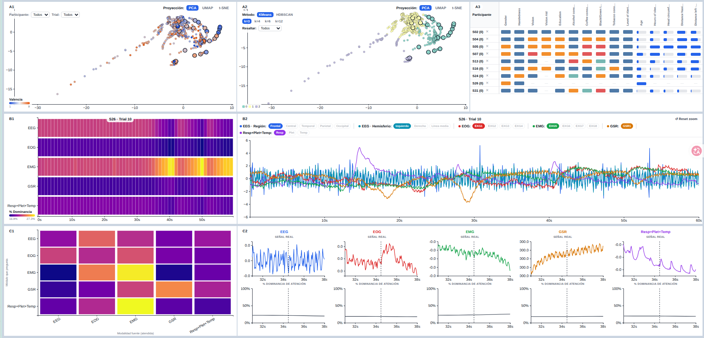

Este documento reconstruye, de principio a fin, todo el trabajo hecho a lo largo del curso sobre el dataset [DEAP](https://www.eecs.qmul.ac.uk/mmv/datasets/deap/) (Koelstra et al., 2012): desde el análisis exploratorio de los datos crudos, pasando por tres hipótesis exploratorias y una tarea de espacio latente con características manuales, hasta el pipeline de preprocesamiento y entrenamiento de un modelo de fusión multimodal (Husformer), y finalmente el sistema de *visual analytics* (VA) construido para interpretar ese modelo — el entregable final del curso.

> **Nota sobre este documento:** es intencionalmente extenso y sirve como memoria completa del proyecto, no solo como instrucciones de instalación. Si buscás algo puntual, usá el índice de abajo.

---

## Índice

1. [Resumen del proyecto](#1-resumen-del-proyecto)
2. [El dataset DEAP](#2-el-dataset-deap)
   - [2.1 Qué es y de dónde viene](#21-qué-es-y-de-dónde-viene)
   - [2.2 Protocolo experimental](#22-protocolo-experimental)
   - [2.3 Estructura de los archivos `.bdf`](#23-estructura-de-los-archivos-bdf)
   - [2.4 Los archivos de metadata](#24-los-archivos-de-metadata)
   - [2.5 Comportamiento de los datos (hallazgos del EDA)](#25-comportamiento-de-los-datos-hallazgos-del-eda)
3. [Fase exploratoria: 3 hipótesis + Tarea 1](#3-fase-exploratoria-3-hipótesis--tarea-1)
   - [3.1 Hipótesis 1 — Exploración Temporal](#31-hipótesis-1--exploración-temporal)
   - [3.2 Hipótesis 2 — Relaciones Multimodales](#32-hipótesis-2--relaciones-multimodales)
   - [3.3 Hipótesis 3 — Patrones Espaciales EEG](#33-hipótesis-3--patrones-espaciales-eeg)
   - [3.4 Tarea 1 — Espacio Latente con Características Manuales](#34-tarea-1--espacio-latente-con-características-manuales)
4. [Pipeline técnico: de `.bdf` crudo a representaciones de Husformer](#4-pipeline-técnico-de-bdf-crudo-a-representaciones-de-husformer)
   - [4.1 Preprocesamiento de señal](#41-preprocesamiento-de-señal)
   - [4.2 Ventaneo y separación por modalidad](#42-ventaneo-y-separación-por-modalidad)
   - [4.3 Etiquetado y partición train/valid/test](#43-etiquetado-y-partición-trainvalidtest)
   - [4.4 Husformer: arquitectura y entrenamiento](#44-husformer-arquitectura-y-entrenamiento)
   - [4.5 Hallazgo crítico: el sesgo de la máscara causal](#45-hallazgo-crítico-el-sesgo-de-la-máscara-causal)
   - [4.6 Extracción de representaciones para el sistema VA](#46-extracción-de-representaciones-para-el-sistema-va)
5. [El sistema de Visual Analytics](#5-el-sistema-de-visual-analytics)
   - [5.1 Motivación, problema y objetivos](#51-motivación-problema-y-objetivos)
   - [5.2 Análisis de tareas](#52-análisis-de-tareas)
   - [5.3 Arquitectura general: vistas múltiples coordinadas](#53-arquitectura-general-vistas-múltiples-coordinadas)
   - [5.4 Vista A — Espacio de Representaciones Fusionadas](#54-vista-a--espacio-de-representaciones-fusionadas)
   - [5.5 Vista B — Atención Temporal del Trial](#55-vista-b--atención-temporal-del-trial)
   - [5.6 Vista C — Detalle Anclado a la Señal Cruda](#56-vista-c--detalle-anclado-a-la-señal-cruda)
   - [5.7 Interacciones y coordinación entre vistas](#57-interacciones-y-coordinación-entre-vistas)
6. [Arquitectura técnica del software](#6-arquitectura-técnica-del-software)
7. [Cómo correr el sistema](#7-cómo-correr-el-sistema)
8. [Diagramas — prompts para generarlos](#8-diagramas--prompts-para-generarlos)
9. [Limitaciones y trabajo futuro](#9-limitaciones-y-trabajo-futuro)
10. [Referencias](#10-referencias)

---

## 1. Resumen del proyecto

El hilo conductor de todo el curso fue el dataset DEAP: 32 participantes, 40 *trials* por participante, señales EEG y fisiológicas registradas mientras cada participante veía un fragmento musical de un minuto, más autoevaluaciones subjetivas de Valencia, Activación (Arousal), Dominancia y Agrado (Liking). El proyecto avanzó en tres grandes etapas:

1. **Análisis exploratorio de datos (EDA) y formulación de hipótesis** — entender la estructura cruda del dataset (`.bdf`, metadata) y plantear tres preguntas exploratorias sobre los datos, cada una resuelta con un dashboard interactivo propio.
2. **Espacio latente con características manuales (Tarea 1)** — un primer acercamiento a "representación aprendida" usando features clásicos de EEG/fisiología (potencia por banda, etc.), proyectados a 2D.
3. **Sistema de Visual Analytics para interpretar un modelo de fusión multimodal** — el entregable final: se entrenó [Husformer](https://github.com/SMARTlab-Purdue/Husformer) (Wang et al., 2022), un *transformer* de fusión multimodal, sobre las 5 modalidades fisiológicas de DEAP, y se construyó un sistema de VA (arquitectura de vistas múltiples coordinadas, CMV) para explorar e interpretar tanto el espacio de representaciones aprendidas como los pesos de atención cross-modal del modelo.

Estas tres etapas quedaron implementadas como pestañas separadas dentro de la misma aplicación web (`frontend/index.html`): **H1** (Hipótesis 1), **H2** (Hipótesis 2 y 3, en el mismo dashboard), **Tarea 1** y **System Overview** (el sistema final).

---

## 2. El dataset DEAP

### 2.1 Qué es y de dónde viene

DEAP (*Database for Emotion Analysis using Physiological Signals*) es un dataset multimodal desarrollado por investigadores de Queen Mary University of London, University of Twente y University of Geneva, diseñado para el análisis de emociones humanas a partir de señales fisiológicas y estímulos audiovisuales (Koelstra et al., 2012). Se construyó seleccionando inicialmente 120 videos musicales candidatos mediante etiquetas afectivas de Last.fm y selección manual; tras una ronda de anotación subjetiva de valencia/activación por voluntarios, se retuvieron los 40 estímulos con respuestas emocionales más consistentes.

- **32 participantes**, cada uno expuesto a los mismos **40 trials** (fragmentos musicales de un minuto).
- **EEG:** 32 canales, sistema internacional 10-20, 512 Hz.
- **Señales periféricas:** EOG (2 canales derivados en 4 señales hEOG/vEOG), EMG (zigomático mayor + trapecio, 4 señales), respuesta galvánica de la piel (GSR), respiración, fotopletismografía (Plet) y temperatura de la piel — 48 canales en total por archivo `.bdf` (49 para los participantes S29-S32, que incluyen un canal adicional).
- **Autoevaluación subjetiva** tras cada trial mediante escalas SAM (*Self-Assessment Manikin*): Valencia, Activación, Dominancia, Agrado (Liking) y Familiaridad.

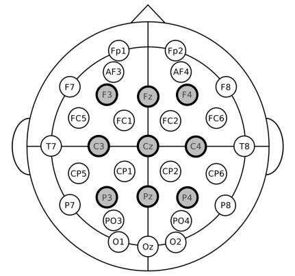

### 2.2 Protocolo experimental

Cada trial sigue una estructura temporal fija: un período de **baseline** (línea base, sin estímulo), la **reproducción del estímulo** audiovisual (~60s) y una etapa posterior de **autoevaluación** mediante las escalas SAM. Estos eventos quedan marcados en el canal `Status` de cada archivo `.bdf` (eventos 3→4→5 por trial), lo que permite alinear temporalmente cualquier señal fisiológica con la fase exacta del experimento en la que fue registrada — esta alineación es, más adelante, uno de los pasos técnicos más delicados de todo el pipeline (ver [4.1](#41-preprocesamiento-de-señal)).

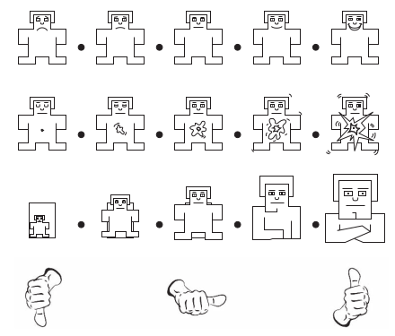

### 2.3 Estructura de los archivos `.bdf`

Cada archivo `.bdf` (formato BioSemi, extensión del estándar EDF) se organiza en tres bloques secuenciales: un **header fijo** de 256 bytes (participante, fecha, cantidad de canales, cantidad de *data records*), un **header por canal** (256×N bytes, N=canales — nombre, unidad física, rangos digital/físico, muestras por registro) y los **data records** propiamente dichos, cada uno de 1 segundo de duración con 512 muestras por canal, codificadas en enteros de 24 bits con signo (`int24`), convertidas después a valor físico (µV, Ω, °C según el canal) mediante una transformación lineal estándar del formato EDF/BDF.

El dataset RAW completo suma **61,348,864 registros** (muestras × canal × participante) y ocupa **~8.25 GB** en disco (~11 GB si se carga completo en RAM como `float32`) — manejable trabajando participante por participante, no cargando los 32 archivos simultáneamente. No se encontraron valores nulos en ningún canal de ningún participante.

### 2.4 Los archivos de metadata

Además de los 32 (o 34, según el conteo) archivos `.bdf`, el dataset incluye 4 archivos de metadata:

| Archivo                       | Contenido                                                                                                                                                                           | Registros |
| ----------------------------- | ----------------------------------------------------------------------------------------------------------------------------------------------------------------------------------- | --------- |
| `online_ratings`            | Evaluaciones de la fase de selección online de los 40 videos (valencia/activación/dominancia + rueda emocional)                                                                   | 1,778     |
| `participant_ratings`       | Evaluación de cada participante para cada uno de sus 40 trials (valencia/activación/dominancia/agrado/familiaridad)                                                               | 1,280     |
| `participant_questionnaire` | Datos demográficos y de cuestionario por participante (edad, género, lateralidad manual, consumo de alcohol/cafeína/tabaco, horas de sueño, medidas antropométricas de cabeza) | 32        |
| `video_list`                | Metadata de cada video (artista, título, enlace de YouTube, estadísticas agregadas de valencia/activación)                                                                       | 40        |

### 2.5 Comportamiento de los datos (hallazgos del EDA)

Del análisis exploratorio completo (`pdf/partial1/JorgeTito_Informe_DataWrangling_AED.pdf`):

- Las variables **Valencia, Activación y Dominancia** (tanto en `online_ratings` como en `participant_ratings`) siguen distribuciones discretas/continuas dentro del rango 1-9, con concentración alrededor de valores medios-altos y medianas cercanas a 5 — sin un sesgo extremo hacia ningún extremo emocional.
- **Correlaciones moderadas** entre las dimensiones afectivas: Valencia correlaciona positivamente con Agrado (r≈0.62) y con Dominancia (r≈0.52) en `participant_ratings` — trials percibidos como más positivos tienden a asociarse con mayor agrado y sensación de control.
- **Familiaridad** tiene una distribución fuertemente desigual, concentrada en valores bajos — la mayoría de los participantes reportó poca familiaridad previa con los estímulos musicales usados.
- **Sin valores nulos** en las señales fisiológicas de ningún participante; `Familiarity` en `participant_ratings` sí tiene valores faltantes (1,160 de 1,280 registros).
- Todos los canales mantienen una **frecuencia uniforme de 512 muestras/registro**, consistencia temporal completa entre señales.

---

## 3. Fase exploratoria: 3 hipótesis + Tarea 1

Antes de construir el sistema final, el curso pidió formular hipótesis exploratorias sobre el dataset y construir un dashboard interactivo para cada una. Estas tres hipótesis, más una tarea adicional de espacio latente, quedaron implementadas como pestañas de la aplicación (`H1`, `H2`, `Tarea 1` en `frontend/index.html`) y **siguen funcionando** dentro del sistema actual, en paralelo al sistema final (`System Overview`).

### 3.1 Hipótesis 1 — Exploración Temporal

> **¿Será que las señales EEG y fisiológicas presentan cambios temporales diferenciables antes, durante y después de estímulos asociados a distintas variables de autoevaluación del participante?**

Motivación: cada trial de DEAP tiene una estructura temporal definida (antes/durante/después del estímulo), lo que permite explorar si existen cambios dinámicos en la señal asociados a las distintas fases, y si esos cambios se relacionan con las variables de autoevaluación (valencia, activación, dominancia).

**Cómo se resolvió — dashboard H1 (`frontend/js/main.js`):** un panel de "Espacio Emocional" (scatter interactivo de Valencia vs. Activación, con ejes intercambiables entre las 4 dimensiones VAD), un panel de "Métricas de Resumen" (media, RMS, mín/máx por canal, comparando antes/durante/después) y una vista de "Exploración de Señal" (todas las señales del trial seleccionado, superpuestas, con opción de normalizar).

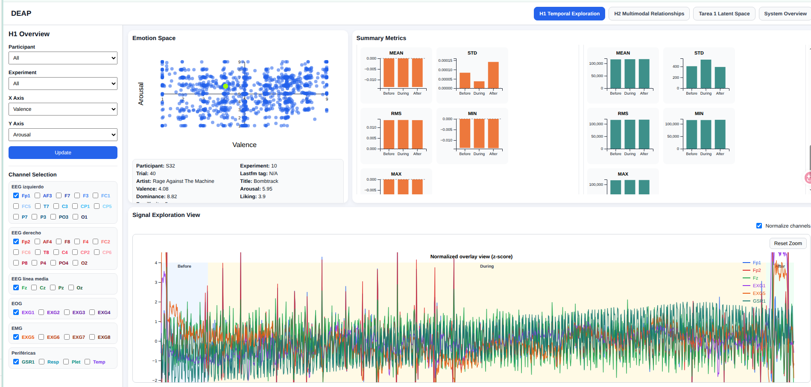

### 3.2 Hipótesis 2 — Relaciones Multimodales

> **¿Será que distintos grupos de señales fisiológicas y EEG presentan patrones de relación diferenciables entre participantes durante la exposición a estímulos emocionales?**

Motivación: dada la naturaleza multimodal de DEAP (EEG + periféricas registradas simultáneamente), cada participante puede reaccionar de forma distinta frente a un mismo estímulo — esta hipótesis explora si existen relaciones diferenciables entre grupos de señales (a nivel cerebral y fisiológico) entre distintos participantes.

**Cómo se resolvió — dashboard H2, pestaña "Multimodal Relationships" (`frontend/js/h2_main.js`):** una matriz de correlación (canales EEG vs. un canal de referencia EXG, por participante), un "Explorador Temporal Cross-Modal" (superpone dos señales normalizadas con su correlación de Pearson) y un panel de "Perfiles de Participante" (comparación de atributos de cuestionario para los participantes seleccionados en la matriz).

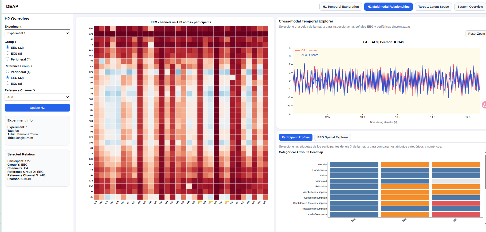

### 3.3 Hipótesis 3 — Patrones Espaciales EEG

> **¿Será que las relaciones entre canales EEG y señales de referencia presentan patrones espaciales diferenciables sobre la distribución cerebral del sistema 10-20?**

Motivación: dado que cada canal EEG del sistema 10-20 registra actividad asociada a una región cerebral distinta, esta hipótesis explora si esas relaciones (con arousal, valencia o señales periféricas) se distribuyen espacialmente de forma diferenciable sobre el mapa cerebral.

**Cómo se resolvió:** vive dentro del **mismo dashboard que Hipótesis 2** (pestaña `H2`, sub-vista "EEG Spatial Explorer", ver `h2_eeg_spatial_chart.js`) — reutiliza la misma matriz de relaciones, pero en vez de un panel de perfiles de participante, muestra un mapa topográfico del casco EEG coloreado según la fuerza de la relación seleccionada.

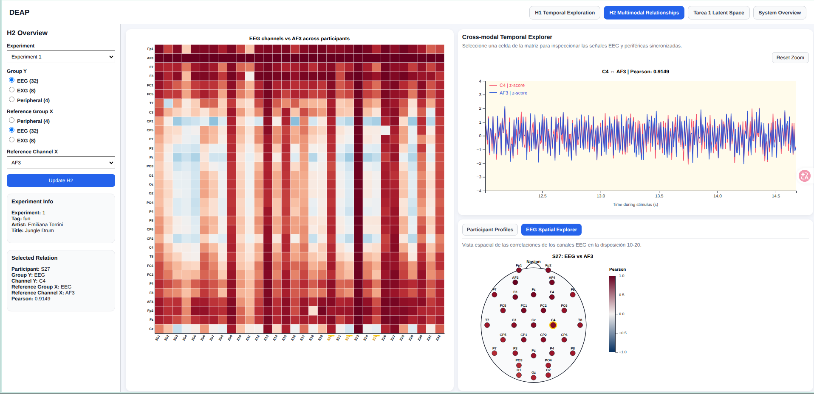

### 3.4 Tarea 1 — Espacio Latente con Características Manuales

Un primer acercamiento, previo a Husformer, a la idea de "espacio de representación": en vez de un modelo aprendido, se calcularon **características manuales** por trial (potencia log por banda de frecuencia vía Welch, y estadísticos de las señales periféricas — `backend/scripts/representations/eeg_features.py`, `physiological_features.py`), se normalizaron, y se proyectaron a 2D (PCA/UMAP/t-SNE).

**Dashboard Tarea 1 (`frontend/js/tarea1_main.js`):** scatter de la proyección 2D (coloreado/filtrable por participante o experimento), tarjeta de detalle del trial seleccionado, comparación de perfiles de participante (reutiliza el mismo componente que H2) y un explorador de señal cruda por canal del trial activo.

Este ejercicio sirvió como **antecedente directo de A1** en el sistema final — la misma idea (proyectar un espacio de representación a 2D y explorar interactivamente) se retomó luego con las representaciones *aprendidas* por Husformer en vez de features manuales.

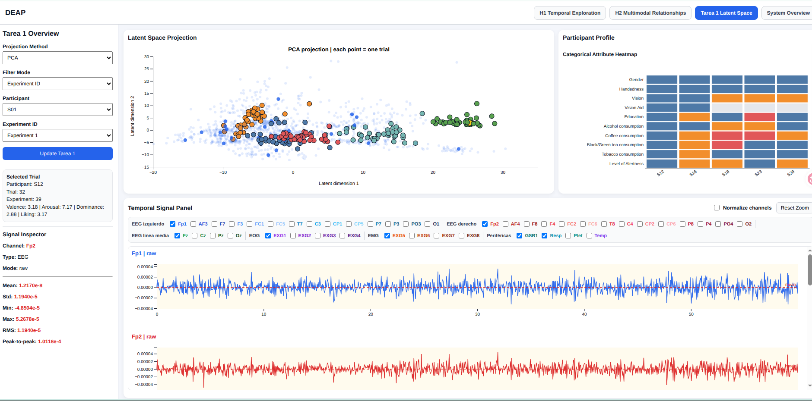

---

## 4. Pipeline técnico: de `.bdf` crudo a representaciones de Husformer

Esta es la columna vertebral que conecta los datos crudos de la Sección 2 con el sistema de VA de la Sección 5. Se implementó íntegramente en `backend/scripts/` y `husformer_deap_va/` (copia de trabajo del repositorio [Husformer](https://github.com/SMARTlab-Purdue/Husformer) original, que se dejó intacto en `Husformer/` como referencia).

```
.bdf crudo (32 archivos, 512 Hz, 48 canales)
        │
        ▼
preprocess_trials.py / preprocess_representation_inputs.py
        │  ICA (remoción de artefactos oculares) + filtro EEG 4-45 Hz +
        │  resample a 128 Hz + selección de 44 canales + extracción fase "During"
        ▼
representation_inputs/sXX/trial_XX_input.npz   (44 canales × 7680 muestras, 60s)
        │
        ▼
backend/scripts/husformer/build_husformer_dataset.py
        │  1. Ventaneo: 60 ventanas de 1s (128 muestras) por trial → 76,800 ventanas totales
        │  2. Separación en 5 modalidades (EEG/EOG/EMG/GSR/Resp+Plet+Temp)
        │  3. Etiqueta discreta de 3 clases desde Valencia (bajo/medio/alto)
        │  4. Split train/valid/test POR PARTICIPANTE (26/3/3)
        ▼
husformer_deap_va/data/husformer.pkl
        │
        ▼
husformer_deap_va/main.py   (entrenamiento — GPU NVIDIA GTX 1660 Ti, ~15h/40 épocas)
        │
        ▼
backend/scripts/husformer/extract_representations.py
        │  Corre inferencia sobre TODO el dataset con el checkpoint entrenado,
        │  guarda last_hs + attn_final_summary + attn_cross_summary por ventana
        ▼
backend/scripts/husformer/generate_trial_projections.py
        │  Mean-pooling de last_hs por trial (60 ventanas → 1 vector de 40-dim),
        │  estandarización + proyección PCA/UMAP/t-SNE
        ▼
Representaciones + proyecciones 2D + manifest de trazabilidad
        → consumidas por el sistema de Visual Analytics (Sección 5)
```

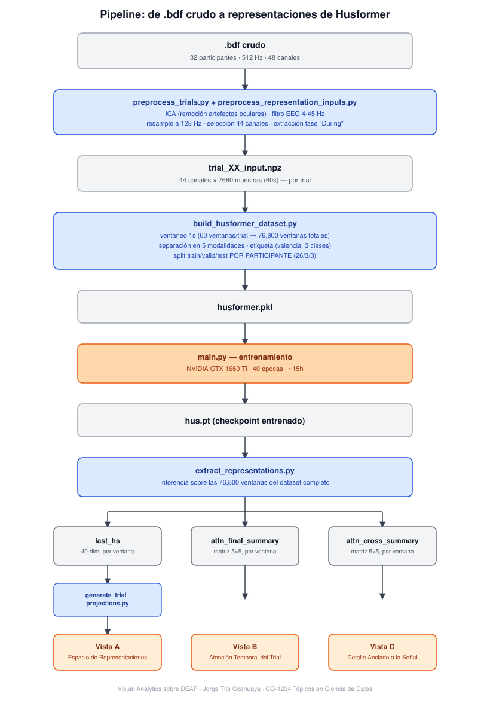

### 4.1 Preprocesamiento de señal

`preprocess_trials.py` lee cada archivo `.bdf`, detecta el canal `Status` y reconstruye los eventos de cada trial (inicio de baseline → inicio de estímulo → fin de estímulo). Un caso especial: el participante **S28** tiene el canal `Status` corrupto/incompleto, así que sus eventos se reconstruyen indirectamente a partir de `participant_ratings.xls` en vez del canal real — por esta razón, S28 se excluyó del sorteo aleatorio de splits y se forzó manualmente al split de `train` (ver 4.3), al ser una referencia menos confiable para evaluación.

`preprocess_representation_inputs.py` continúa desde ahí:

- Selecciona **44 canales** (de los 48-49 totales): 32 EEG en orden Geneva 10-20 + 4 EOG (EXG1-4) + 4 EMG (EXG5-8) + 4 autonómicas (GSR1, Resp, Plet, Temp) — se descartan `Erg1`/`Erg2` (no usados) y el propio canal `Status`.
- Aplica **ICA** (Análisis de Componentes Independientes) para remover artefactos oculares que contaminan el EEG — un paso más riguroso que el pipeline de demostración del propio repositorio Husformer, que no aplica ICA.
- Filtra el EEG en banda **4-45 Hz** (elimina deriva de baja frecuencia y ruido de alta frecuencia fuera del rango de interés neurofisiológico).
- Remuestrea todas las señales a **128 Hz** (desde los 512 Hz originales).
- Extrae únicamente la fase **"During"** (los ~60s de reproducción del estímulo, sin baseline ni post-estímulo) — 7,680 muestras por canal.
- Guarda el resultado como `representation_inputs/sXX/trial_XX_input.npz`.

**Alineación temporal (hallazgo importante, verificado ANTES de usarlo, no asumido):** las señales fisiológicas crudas que consume la Vista B del sistema final (ver `/api/trial-signals`) devuelven tiempos relativos al **registro completo** del participante (incluye fases Before/During/After); en cambio, el `window_start_sec` de la atención del modelo es relativo **solo al inicio de la fase During**. Sin corregir este desfase, cualquier comparación entre atención del modelo y señal cruda quedaría desalineada en el tiempo — se corrige restando el `start` de la fase "During" a cada timestamp de la señal cruda antes de graficarla (ver `frontend/js/charts/husformer_b3_chart.js`, `extractDuringPhaseSamples`).

### 4.2 Ventaneo y separación por modalidad

`backend/scripts/husformer/build_husformer_dataset.py` orquesta el resto del pipeline hacia el formato que Husformer espera (`Husformer.pkl`):

- **Ventaneo** (`windowing.py`): cada trial de 60s se corta en **60 ventanas de 1 segundo** (128 muestras a 128 Hz) — mismo esquema de ventaneo que usa el Husformer original. Total: 32 participantes × 40 trials × 60 ventanas = **76,800 ventanas**.
- **Separación en 5 modalidades** (`channel_modalities.py`, decisión de diseño confirmada): EEG (32 canales), EOG (4), EMG (4), **GSR separado como su propia modalidad** (1 canal) y Resp+Plet+Temp agrupadas (3 canales). GSR se separó del resto de señales autonómicas porque es, según la literatura DEAP, la señal periférica más informativa para valencia/activación — separarla permite que la atención cross-modal del modelo la trate de forma independiente, en vez de diluida dentro de un grupo "autonómico" más amplio.

### 4.3 Etiquetado y partición train/valid/test

- **Etiqueta de entrenamiento** (`labeling.py`): valencia continua (1-9) discretizada a 3 clases (bajo 1-3 / medio 4-6 / alto 7-9), igual que el esquema original de Husformer/DEAP. Importante: esta etiqueta solo *supervisa* el entrenamiento — el sistema de VA final puede colorear/filtrar por **cualquier** dimensión VAD (valencia, activación, dominancia, agrado), sin que el modelo haya sido entrenado específicamente para predecir esas otras dimensiones.
- **Split por participante, no por ventana** (`participant_split.py`, decisión de diseño crítica): el código original de Husformer/DEAP mezcla todas las ventanas de todos los participantes con *shuffle* aleatorio a nivel de ventana — esto genera **fuga de datos**, porque ventanas consecutivas del mismo trial son casi idénticas y podrían quedar repartidas entre train y test. Se corrigió particionando por **participante completo**: 26 participantes a `train`, 3 a `valid`, 3 a `test`, sin que ningún participante aparezca en más de un split — una evaluación más exigente (generalización entre sujetos) pero metodológicamente correcta, dado que el objetivo del proyecto es interpretar representaciones, no maximizar accuracy de clasificación.
- **Manifest de trazabilidad** (`manifest.py`): el identificador (`id`) dentro del `.pkl` de Husformer es un índice arbitrario sin significado para el modelo — pero el sistema de VA sí necesita saber a qué participante/trial/ventana corresponde cada representación. `husformer_manifest.csv` guarda esa trazabilidad completa (`participant_id`, `trial`, `window_index`, `window_start_sec`, split, y las 4 etiquetas VAD), y es la pieza que permite, después del entrenamiento, reconectar cualquier `last_hs`/peso de atención con su contexto humano original.

### 4.4 Husformer: arquitectura y entrenamiento

[Husformer](https://arxiv.org/abs/2209.15182) (Wang et al., 2022) es un *transformer* diseñado para fusión multimodal de estados humanos: cada modalidad se proyecta primero a un espacio común, luego pasa por **5 módulos de atención cross-modal** (uno por modalidad, `trans_m{i}_all`) que deciden cuánto debe atender cada modalidad a las demás (incluida ella misma), sus salidas se concatenan, y esa concatenación pasa por un **transformer de auto-atención final** (`trans_final`) que produce la representación fusionada definitiva. Tras una capa convolucional y pooling, se obtiene `last_hs`, un vector de 40 dimensiones por ventana — la representación que el sistema de VA proyecta y explora en la Vista A.

El repositorio original se adaptó (copia de trabajo en `husformer_deap_va/`) para las 5 modalidades de DEAP (ver 4.2) y se entrenó localmente sobre una NVIDIA GTX 1660 Ti (6GB, Turing) — un modelo chico comparado con LLMs o transformers de visión (`d_m=30`, pocas capas), entrenable en minutos/horas, no días.

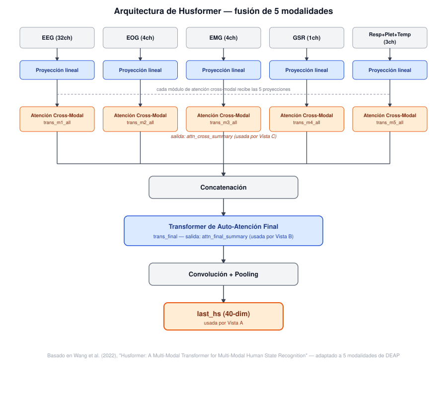

### 4.5 Hallazgo crítico: el sesgo de la máscara causal

El hallazgo metodológico más importante de todo el proyecto, documentado en detalle en `md/husformer_b1_resumen_implementacion.md`: al inspeccionar por primera vez los pesos de atención extraídos, resultaron casi idénticos entre trials distintos (variaban recién desde el 6to-7mo dígito decimal) y, dentro de un mismo trial, siempre en el mismo orden fijo (EEG > EOG > EMG ≈ GSR > Resp+Plet+Temp), sin excepción.

**Diagnóstico** (script standalone independiente de Flask, `diagnostico_attn_final.py`): la matriz de desviación estándar por celda, calculada sobre todas las ventanas, resultó exactamente **triangular inferior** — el triángulo superior era cero exacto en absolutamente todas las ventanas.


**Causa raíz:** el repositorio Husformer (heredado de MulT, su arquitectura base) aplica por *default* una **máscara causal** (`attn_mask=True`) sobre las posiciones concatenadas de las 5 modalidades. Con máscara causal, el primer bloque de la concatenación (EEG) solo puede atenderse a sí mismo, mientras que el último bloque (Resp+Plet+Temp) puede atender a los 5 — un sesgo puramente **estructural**, determinado por el orden arbitrario de concatenación de las modalidades, no por ningún patrón aprendido. Esto explica por sí solo el patrón "EEG domina siempre".

**Decisión y corrección:** se reentrenó el modelo completo (40 épocas) con la máscara causal **desactivada** (`--attn_mask` pasado explícitamente) — justificado porque las 5 modalidades fisiológicas concatenadas no tienen ninguna relación de orden temporal real entre sí (a diferencia de texto/audio alineados temporalmente, para lo que MulT fue diseñado originalmente). Es una desviación explícita y documentada del *default* del repositorio, no un bug de nuestra adaptación. Tras el reentrenamiento y una nueva extracción, la matriz de atención ya no tiene ceros estructurales, y el ranking de "qué modalidad domina" deja de ser fijo — varía según el trial (verificado con `diagnostico_attn_final.py` corrido de nuevo sobre las representaciones nuevas).

**Caveat honesto:** el desempeño de clasificación del checkpoint entrenado es modesto (accuracy de validación cerca del azar en el mejor caso) — la variación de atención observada es real pero sutil, algo que se declara explícitamente como limitación (ver Sección 9), no se oculta.

### 4.6 Extracción de representaciones para el sistema VA

`extract_representations.py` corre inferencia sobre las 76,800 ventanas del dataset completo con el checkpoint entrenado y guarda, por ventana:

- **`last_hs`** (40-dim): la representación fusionada final — insumo de la Vista A.
- **`attn_final_summary`** (matriz 5×5 por ventana): auto-atención del transformer de fusión final — insumo de la Vista B (B1/B2).
- **`attn_cross_summary`** (matriz 5×5 por ventana): los 5 módulos de atención cruzada previos a la fusión final — insumo de la Vista C.

`generate_trial_projections.py` agrega `last_hs` por trial (mean-pooling de sus ~60 ventanas — 29 para el caso especial de S28/trial 40, con grabación real más corta), estandariza y proyecta a 2D con PCA/UMAP/t-SNE — la salida que consume directamente A1.

**`attn_final_summary` vs. `attn_cross_summary` — no son la misma información**, distinción central para justificar por qué el sistema tiene vistas separadas para cada una: `attn_cross_summary` son los pesos de atención de la fase de fusión cruzada (la "receta de mezcla" — cuánto le hizo caso una modalidad a otra); `attn_final_summary` es la auto-atención de un mecanismo *completamente distinto y posterior* (la fusión final), y `last_hs` es el resultado después de aplicar esa receta, pasarlo por el segundo mecanismo de atención, y comprimirlo. Dos trials podrían compartir la misma "receta de mezcla" (`attn_cross_summary` parecido) pero terminar con `last_hs` distintos, o al revés — por eso A1/A2 (que usan `last_hs`), B1/B2 (que usan `attn_final_summary`) y C1/C2 (que usan `attn_cross_summary`) responden preguntas genuinamente distintas, no redundantes entre sí.

---

> **Nota:** cada panel del sistema (A1, A2, A3, B1, B2, C1, C2) tiene además su propio documento técnico extendido en `md/husformer_*_resumen_implementacion.md`, actualizado en el momento en que se tomó cada decisión de diseño, con más detalle del que cabe aquí (incluyendo bugs encontrados y el historial completo de rediseños). Esta sección resume esos documentos, no los reemplaza.

## 5. El sistema de Visual Analytics

### 5.1 Motivación, problema y objetivos

La mayoría de los modelos multimodales de reconocimiento afectivo operan como cajas negras: fusionan modalidades mediante mecanismos internos (p. ej. atención cruzada) cuyas representaciones intermedias rara vez se inspeccionan. Esta opacidad impide responder preguntas básicas: ¿qué modalidad domina la predicción en un instante dado?, ¿la atención del modelo coincide con lo que se esperaría fisiológicamente?, ¿existen artefactos que el modelo esté atendiendo incorrectamente? Sistemas de visual analytics previos para datos afectivos/multimodales (EmoCo, E-ffective, V-Awake, TSSeer) no abordan específicamente la inspección de representaciones aprendidas por un modelo de fusión aplicado a EEG y señales fisiológicas — ese es el vacío que este proyecto llena, usando Husformer sobre DEAP como caso de estudio (el diseño del sistema, no obstante, busca mantenerse agnóstico a la arquitectura específica del modelo de fusión).

**Objetivo general:** diseñar e implementar un sistema de VA que permita explorar e interpretar las representaciones latentes y los patrones de atención cross-modal de un modelo de fusión multimodal sobre señales EEG y fisiológicas.

**Objetivos de diseño (Goals):**

- **G1** — Comprender la variabilidad entre participantes y trials en el espacio de representaciones aprendidas, contrastándola con el autorreporte subjetivo de VAD.
- **G2** — Comprender la dinámica temporal de la atención cross-modal dentro de un trial.
- **G3** — Relacionar los patrones de atención del modelo con las señales fisiológicas originales y con el conocimiento fisiológico esperado.
- **G4** (transversal) — Sostener una exploración interactiva y bajo demanda de los pesos de atención, en contraste con visualizaciones estáticas y post-hoc.

### 5.2 Análisis de tareas

Siguiendo la tipología de tareas de Brehmer y Munzner (2013), las tareas se organizan en 3 niveles de granularidad (participante → trial → modalidad/instante):

| Tarea                         | Descripción                                                                                   | Categoría              | Goals  |
| ----------------------------- | ---------------------------------------------------------------------------------------------- | ----------------------- | ------ |
| **T1**                  | Identificar participantes o trials cuya representación latente se aparta del resto            | Query: Identify         | G1, G4 |
| **T2**                  | Comparar trials o participantes en el espacio de representación fusionada                     | Query: Compare          | G1, G4 |
| **T3**                  | Explorar la evolución temporal de los pesos de atención cross-modal dentro de un trial       | Search: Explore         | G2, G4 |
| **T4**                  | Identificar segmentos temporales donde una modalidad domina la representación fusionada       | Query: Identify         | G2, G4 |
| **T5**                  | Relacionar picos o cambios abruptos en la atención con eventos visibles en la señal original | Query: Compare          | G2, G4 |
| T6-T8 (formulación original) | Inspeccionar/comparar atención cross-modal a nivel de ventana puntual                         | Query: Identify/Compare | G3, G4 |

> **⚠️ Nota de honestidad metodológica:** T6-T8, tal como están redactadas en el paper (`articulo_DEAP_visualization/secciones/03_datos_y_tareas_analiticas.tex`), describen la formulación **original** de Vista C (drill-down desde una ventana seleccionada en Vista B). La implementación actual de C1/C2 (ver 5.6) evolucionó de esa formulación durante el desarrollo — sigue sirviendo a G3, pero el mecanismo de interacción cambió. **Reescribir T6-T8 y la Sección 5 del paper para reflejar el diseño vigente es trabajo pendiente**, no un error no declarado.

### 5.3 Arquitectura general: vistas múltiples coordinadas

El sistema sigue una arquitectura de **vistas múltiples coordinadas** (CMV, *Coordinated Multiple Views* — Munzner, Cap. 12 *Facet into Multiple Views*), organizada en tres vistas (A, B, C) disponibles simultáneamente en pantalla, cada una con 2-3 sub-paneles, coordinadas mediante *brushing-and-linking*. La disposición sigue una lógica de **drill-down progresivo**: Vista A (overview del dataset completo, 1280 trials) → Vista B (dinámica temporal de UN trial) → Vista C (detalle anclado a un instante de la señal cruda de B).

```
┌─────────────┬─────────────┬─────────────┐
│      A1     │      A2     │      A3     │   Vista A — overview (1280 trials)
├─────────────┴─┬───────────┴─────────────┤
│      B1        │           B2           │   Vista B — dinámica temporal (1 trial)
├─────────────┬──┴───────────┬─────────────┤
│      C1     │           C2              │   Vista C — detalle anclado a B2
└─────────────┴───────────────────────────┘
```

### 5.4 Vista A — Espacio de Representaciones Fusionadas

**Qué muestra:** overview de los 1280 trials del dataset completo (32 participantes × 40 trials), todos visibles a la vez.

**A1 — Proyección del espacio latente.** Scatter 2D (PCA, UMAP o t-SNE, seleccionable) de `last_hs` (representación fusionada, 40-dim, agregada por trial vía mean-pooling). Color = valencia autorreportada (escala divergente azul-naranja, no roja-verde — accesible para daltonismo rojo-verde). Zoom/pan, filtros por participante/trial (atenúan sin ocultar), selección múltiple.
*Justificación:* atiende T1 — Munzner Cap. 2 (*What: Data Abstraction*) para la derivación de `last_hs` como atributo cuantitativo derivado; Cap. 10 (*Map Color and Other Channels*) para la escala de color accesible; Cap. 11 (*Manipulate View*) para zoom/pan con ejes re-escalados.

**A2 — Agrupamiento algorítmico.** Mismo layout de puntos que A1 (misma proyección, sincronizada), pero coloreado por cluster (KMeans o HDBSCAN, calculado al vuelo sobre el vector de 40-dim estandarizado — **nunca** sobre las coordenadas 2D ya proyectadas, para no heredar las distorsiones de PCA/UMAP/t-SNE).
*Justificación:* atiende T2 — Munzner Cap. 13 (*Reduce Items and Attributes*) para la justificación de clusterizar sobre el espacio real, no el proyectado; Cap. 12.3.1 (*Share Encoding*) para la coordinación con A1 (mismos ítems y layout, codificación de color distinta).

**A3 — Perfil de participante.** Tabla de comparación tipo LineUp (Gratzl et al., 2013) de atributos de cuestionario (género, lateralidad, consumo de alcohol/cafeína, edad, horas de sueño, etc.) para los participantes con al menos un trial en la selección compartida de A1/A2 — barras compactas por atributo en vez de texto plano.
*Justificación:* complementa T1/T2 — una vez identificado un trial/participante atípico (A1) o un cluster estructural (A2), A3 permite explorar si ese subconjunto comparte rasgos demográficos, como hipótesis explicativa adicional. *(Nota de proceso: A3 pasó por un rediseño completo hacia un mapa de red de patrones de fusión cross-modal entre trials, que se implementó por completo y luego se descartó el mismo día por decisión de diseño — ver `md/husformer_a3_resumen_implementacion.md` Sección 5 para el historial íntegro de esa exploración, incluida la justificación de por qué se abandonó.)*


### 5.5 Vista B — Atención Temporal del Trial

**Qué muestra:** dinámica temporal completa de UN trial a la vez (el último clickeado en A1/A2), no toda la selección.

**B1 — Heatmap de dominancia de modalidad.** Matriz modalidad × tiempo (5 filas fijas, ~60 columnas = ventanas de 1s), color = % de dominancia de cada modalidad en `attn_final_summary`, promediado sobre el eje *query* y reescalado a porcentaje relativo (colormap secuencial Plasma, dominio dinámico por trial).
*Justificación:* atiende T3 — Munzner Cap. 7 (*Arrange Tables*, 7.3/7.5.2 Matrix Alignment) para la estructura de matriz; máxima "overview primero, zoom y filtro, detalles bajo demanda" (Shneiderman, 1996); Aigner et al. Cap. 4 (*Visualization Aspects*, 4.2.2) para la justificación del reescalado a porcentaje (todas las modalidades deben compartir una escala unificada para ser comparables).

**B2 — Comparación de señal cruda** *(reetiquetado el mismo día del original "B3"; el B2 original de líneas superpuestas por modalidad se descartó — ver `md/husformer_b1_resumen_implementacion.md`).* Hasta 6 señales fisiológicas reales, normalizadas (z-score) y superpuestas, seleccionables por grupo (EEG por región anatómica o hemisferio; EOG/EMG/GSR/Resp+Plet+Temp por canal individual). Zoom/pan solo en el eje temporal (el eje de valor se deja fijo a propósito, para no sugerir visualmente que una señal "creció" cuando solo cambió el nivel de zoom). Resaltado sincronizado bidireccional con B1 (hover en cualquiera de los dos resalta la misma ventana en el otro, sin reconstruir ningún SVG — *linked highlighting*, Becker & Cleveland, 1987).
*Justificación:* atiende T5 — Aigner et al. Cap. 5 (*Interaction Support*) para el mecanismo de resaltado sincronizado; se descartó explícitamente un gráfico de doble eje para superponer señales de unidades físicas distintas (µV de EEG vs. µS de GSR), por el riesgo de sugerir una relación de escala inexistente.

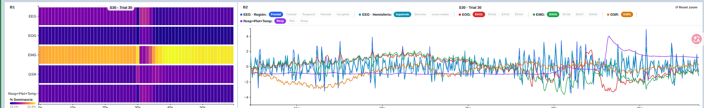

### 5.6 Vista C — Detalle Anclado a la Señal Cruda

**Qué muestra:** detalle de UN instante puntual, elegido haciendo **hover sobre B2** (no sobre B1 — decisión de diseño más reciente del proyecto, ver abajo).

**C1 — Matriz de atención cross-modal de la ventana puntual.** Matriz 5×5 (`attn_cross_summary` cruda, sin promediar) de la ventana exacta bajo el cursor en B2: fila = módulo que "pregunta", columna = modalidad fuente atendida. Colormap Plasma, mismo idioma visual que B1 (*share encoding*).
*Justificación:* atiende a la intención original de T6 (inspeccionar qué modalidad recibe mayor peso en un instante dado), ahora anclado a un instante elegido mirando la señal real, no un heatmap derivado — más coherente con el objetivo real (relacionar un evento visible en la señal con lo que el modelo atendía en ese momento).

**C2 — Señal real + dominancia de atención, juxtapuestas.** Por cada modalidad activa en B2, dos mini-gráficos de línea **apilados** (no superpuestos en un eje compartido) sobre una ventana de ±3 segundos alrededor del hover: arriba, la señal real sin normalizar (unidades propias); abajo, el % de dominancia de esa modalidad (mismo dato ya cargado por B1, reutilizado sin fetch nuevo). Línea guía vertical sincronizada entre ambos gráficos de la tarjeta.
*Justificación:* responde directamente a T5/G3 ("relacionar picos de atención con eventos visibles en la señal") de la forma más literal posible del sistema. Se descartaron, antes de llegar a este diseño, dos alternativas: una tabla numérica del valor exacto en el instante (considerada "demasiado simple" para el espacio disponible) y una línea de atención de una modalidad sobre todo el trial (descartada por redundancia reconocida con B1, que ya cubre ese overview temporal). Se optó explícitamente por gráficos **apilados y no de doble eje** — mismo principio que B2 (Sección 5.5): superponer µV/µS con % de dominancia en un solo eje Y induciría a leer una relación de escala que no existe.

**Historia del diseño de Vista C (honesta, no oculta):** Vista C tuvo **tres diseños distintos** en el transcurso de una sola sesión de trabajo — el original (matriz de ventana puntual, drill-down desde B1), uno intermedio de Small Multiples sobre la selección de A1/A2 (implementado por completo y descartado por Russell), y el vigente (anclado a una acción sobre B2). El código de los dos diseños descartados **no se borró** — queda como referencia en `frontend/js/charts/husformer_c1_small_multiples_chart.js`, `husformer_c2_vad_chart.js` y el endpoint `/api/husformer/selected-trials-cross-attention`. El historial completo, con la justificación de cada cambio, está en `md/husformer_c1_resumen_implementacion.md` Sección 5.

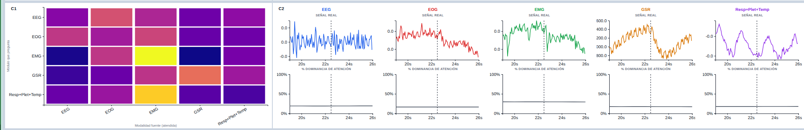

### 5.7 Interacciones y coordinación entre vistas

| Mecanismo                                | Dónde         | Descripción                                                                                                           |
| ---------------------------------------- | -------------- | ---------------------------------------------------------------------------------------------------------------------- |
| **Clicking**                       | A1/A2 → B1/B2 | Seleccionar un punto carga ese trial en Vista B (drill-down)                                                           |
| **Selección múltiple**           | A1/A2 → A3    | Click agrega/quita un trial de la selección compartida; A3 se actualiza con los participantes correspondientes        |
| **Hovering (linked highlighting)** | B1 ↔ B2       | Pasar el cursor sobre una ventana en cualquiera de los dos resalta la misma ventana en el otro, sin reconstruir el SVG |
| **Hovering (drill-down)**          | B2 → C1/C2    | Pasar el cursor sobre la señal cruda en B2 actualiza en tiempo real la matriz (C1) y el detalle señal+atención (C2) |
| **Filtros de resaltado**           | A1             | Por participante y por trial, combinables (AND), atenúan sin ocultar                                                  |
| **Details-on-demand**              | A1, B1, C1, C2 | Tooltips con valores numéricos exactos                                                                                |
| **Sincronización de proyección** | A1 ↔ A2       | Cambiar el método de proyección en cualquiera de los dos mueve al otro (deben mostrar siempre el mismo espacio 2D)   |

Se prefirió **hover sobre click** para las conexiones B→C, decisión tomada tras observar que las matrices de atención cambian de forma sutil entre ventanas vecinas — exigir un click por ventana resultaba demasiado lento para "recorrer" varias ventanas seguidas comparando. El estado se mantiene *sticky* (no vuelve a vacío al retirar el cursor), para que la vista siga disponible mientras se examina.

---

## 6. Arquitectura técnica del software

```
Visual_Analytic_DEAP/
├── dataset/                          # datos crudos y procesados (no versionados en su mayoría)
│   ├── raw/bdf/                      # los 32 archivos .bdf originales de DEAP
│   └── processed/
│       ├── representation_inputs/    # .npz por trial, post-ICA/filtro/resample (Sección 4.1)
│       └── representations/husformer/  # last_hs, attn_*_summary, proyecciones 2D, manifest
├── backend/
│   ├── app.py                        # Flask app factory + registro de blueprints
│   ├── routes/                       # un archivo de rutas por dominio (husformer_*, h2_*, tarea1_*, signal_*)
│   ├── services/                     # lógica de negocio -- lee .npz/.csv, arma la respuesta JSON
│   ├── scripts/husformer/            # pipeline de preprocesamiento -> Husformer.pkl (Sección 4.2-4.3)
│   └── scripts/representations/      # features manuales para Tarea 1 (Sección 3.4)
├── husformer_deap_va/                # copia de trabajo del repo Husformer, adaptada a DEAP (Sección 4.4)
│   ├── src/                          # arquitectura del modelo (modules/, models.py)
│   ├── main.py                       # entrenamiento
│   └── output/hus.pt                 # checkpoint entrenado
├── Husformer/                        # clon ORIGINAL del repo, intacto, como referencia
├── frontend/
│   ├── index.html                    # las 4 pestañas: H1, H2, Tarea 1, System Overview
│   ├── js/
│   │   ├── main.js, h2_main.js, tarea1_main.js, husformer_main.js   # un módulo por pestaña
│   │   └── charts/                   # un archivo D3 por sub-panel (husformer_a1_chart.js, etc.)
│   └── css/layout.css
├── md/                                # documentación viva -- decisiones de diseño, un .md por panel
├── articulo_DEAP_visualization/       # paper en LaTeX (plantilla JAES), en redacción
└── pdf/partial1/                      # informe y diapositivas de Data Wrangling/EDA (Sección 2)
```

**Backend:** Python + Flask, sin base de datos — todo se sirve directamente desde archivos `.csv`/`.npz`/`.npy` ya materializados por el pipeline offline (Sección 4). Cada vista tiene su propio blueprint registrado bajo un prefijo (`/api/husformer`, `/api/h2`, `/api/tarea1`). La mayoría de los cómputos (clustering, agregaciones) se hacen **al vuelo por request**, no precomputados — confirmado que son lo bastante rápidos (milisegundos) sobre el tamaño real del dataset (1280 trials, 40 dimensiones) como para no justificar caché en disco, salvo un caso puntual (mapa de red de A3, descartado, que sí llegó a necesitar caché en memoria por su costo).

**Frontend:** JavaScript vanilla + [D3.js](https://d3js.org/) (v7, importado vía CDN, sin paso de build/bundling) — cada sub-panel del sistema es un módulo ES independiente que exporta una función `renderXXXChart(...)`, orquestado por el módulo `*_main.js` de su pestaña, que mantiene el estado compartido (selección, filtros, zoom) y decide cuándo volver a pedir datos al backend.

**Modelo:** PyTorch, entrenado localmente (GPU NVIDIA GTX 1660 Ti).

---

## 7. Cómo correr el sistema

```bash
# 1. Activar el entorno virtual (ya con las dependencias instaladas)
source env_va_deap/bin/activate

# 2. Levantar el backend (sirve también los archivos estáticos del frontend)
cd Visual_Analytic_DEAP
python -m backend.app
# → http://127.0.0.1:5000
```

No requiere paso de build para el frontend (JS servido directo, D3 desde CDN). El pipeline completo de datos (Sección 4) es un proceso aparte, offline, que ya se corrió y dejó sus artefactos en `dataset/processed/` — no hace falta re-ejecutarlo para levantar el sistema de visualización.

---

## 8. Diagramas — prompts para generarlos

### 8.1 Pipeline completo end-to-end
**Mermaid:**

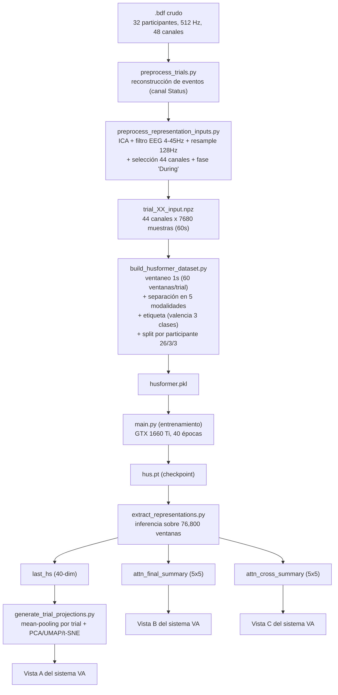


### 8.4 CMV del sistema — vistas coordinadas y drill-down (Mermaid)

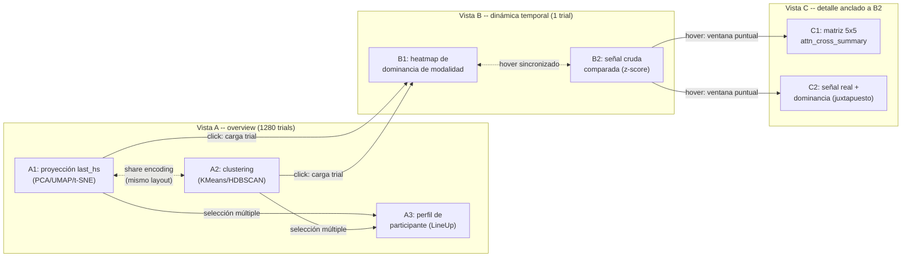

---

---

## 9. Limitaciones y trabajo futuro

- **Sin evaluación con usuarios reales/expertos en cómputo afectivo.** Todo el sistema es funcional y está justificado con literatura de visualización, pero no ha sido validado con las tareas reales de un investigador de dominio (limitación metodológica ya declarada del proyecto).
- **Desempeño modesto del modelo entrenado.** El checkpoint de Husformer usado tiene accuracy de clasificación cercana al azar en el mejor caso (ver 4.5) — la variación de atención observada es real pero sutil; el sistema interpreta un modelo entrenado con recursos y tiempo limitados, no un modelo de estado del arte.
- **T6-T8 y la Sección 5 (Interacciones) del paper están desactualizadas** respecto al diseño vigente de Vista C (ver nota en 5.2) — reescritura pendiente.
- **Vista A/B/C no tienen indicador de confiabilidad del patrón mostrado** — dado el desempeño modesto del modelo, ningún panel comunica visualmente "qué tan confiable" es lo que se está mostrando; queda para la Sección de Discusión del paper, no es algo que la UI resuelva por sí sola.
- **Sin comparación numérica de "cuánto" coinciden picos de atención y señal** en C2 — la comparación es visual, no hay una métrica de correlación calculada automáticamente.
- **Trabajo futuro directo:** cerrar la reescritura de T6-T8, evaluar con al menos un usuario con conocimiento de dominio, y considerar un segundo checkpoint entrenado con activación (arousal) como etiqueta en vez de valencia, para comparar si el modelo organiza el espacio de representación distinto según qué dimensión afectiva supervisa (idea ya discutida en `md/plan_pipeline_husformer_deap_1.md`, no implementada).

---

## 10. Referencias

- Koelstra, S., Muhl, C., Soleymani, M., Lee, J.-S., Yazdani, A., Ebrahimi, T., Pun, T., Nijholt, A., y Patras, I. (2012). "DEAP: A Database for Emotion Analysis Using Physiological Signals". *IEEE Transactions on Affective Computing*, 3(1), 18-31.
- Wang, D., Guo, X., Tian, Y., Liu, J., He, L., y Luo, X. (2022). "Husformer: A Multi-Modal Transformer for Multi-Modal Human State Recognition". *arXiv:2209.15182*.
- Brehmer, M., y Munzner, T. (2013). "A Multi-Level Typology of Abstract Visualization Tasks". *IEEE TVCG*, 19(12), 2376-2385.
- Munzner, T. (2014). *Visualization Analysis and Design*. CRC Press. (Capítulos citados a lo largo de este documento: 2, 3, 5, 6, 7, 10, 11, 12, 13 — resúmenes propios en `md/visualization_analysis_and_design/`.)
- Aigner, W., Miksch, S., Schumann, H., y Tominski, C. (2011). *Visualization of Time-Oriented Data*. Springer. (Capítulos citados: 3, 4, 5, 6, 7 — resúmenes propios en `md/visualization_of_time_oriented_data/`.)
- Shneiderman, B. (1996). "The Eyes Have It: A Task by Data Type Taxonomy for Information Visualizations". *IEEE Symposium on Visual Languages*.
- Becker, R. A., y Cleveland, W. S. (1987). "Brushing Scatterplots". *Technometrics*, 29(2), 127-142.
- Gratzl, S., Lex, A., Gehlenborg, N., Pfister, H., y Streit, M. (2013). "LineUp: Visual Analysis of Multi-Attribute Rankings". *IEEE TVCG*, 19(12), 2277-2286.
- Scherer, K. R. (2005). "What are Emotions? And How Can They be Measured?". *Social Science Information*, 44(4), 695-729.
- Sistemas de VA relacionados citados en el paper (`articulo_DEAP_visualization/jaes.bib`): EmoCo, E-ffective, V-Awake, TSSeer — ver Sección 2 del paper para el detalle comparativo.
